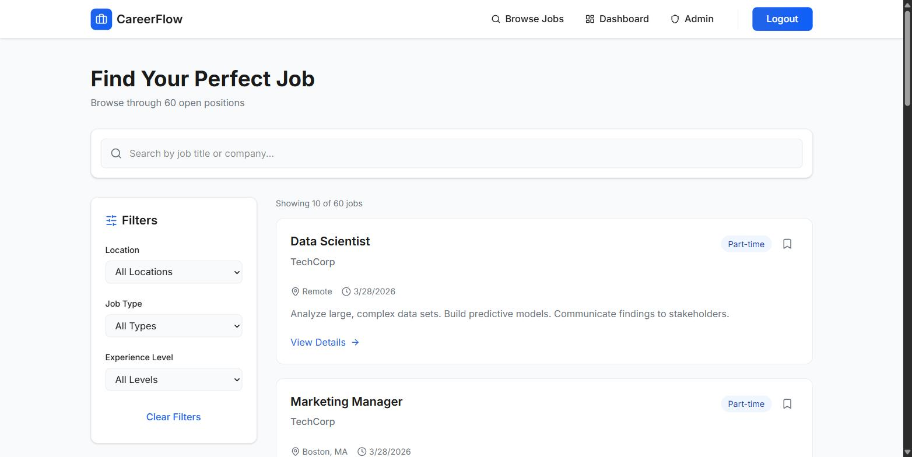
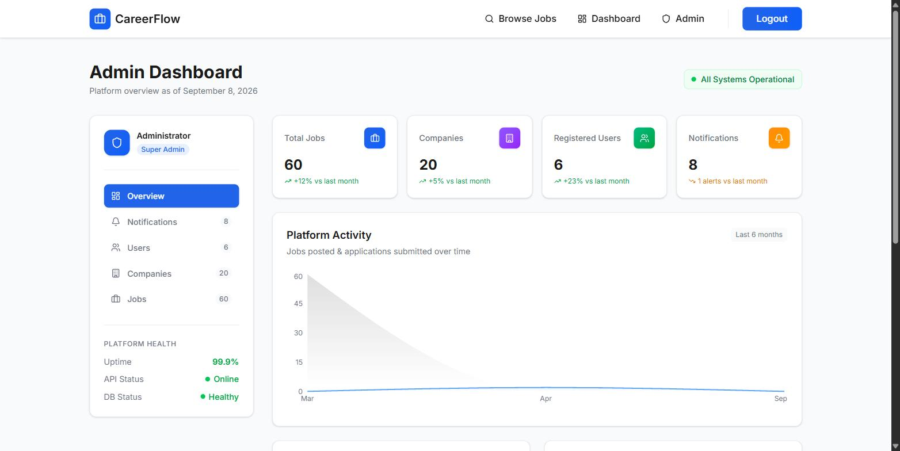
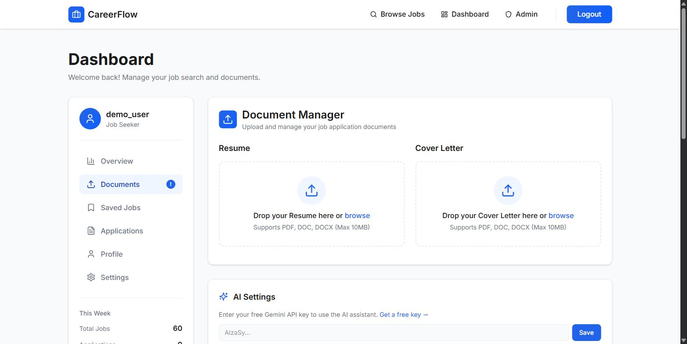
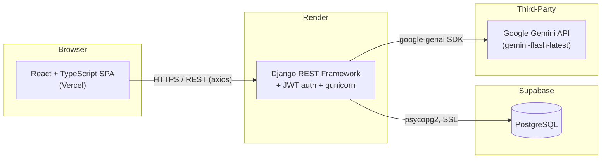

# CareerFlow

A full-stack job search platform — job posting management, saved jobs, application tracking, and AI-assisted resume/cover-letter review — built with a Django REST Framework API and a React + TypeScript frontend.

## Screenshots


*Core workflow: browsing and filtering open positions across companies, with search and location/type/experience filters.*


*Real Django ORM aggregation — platform-wide job, company, and user stats, not mocked data.*


*Resume/cover-letter upload feeding the AI review and generation feature, powered by Gemini.*

## Problem

Job searching is fragmented across job boards, spreadsheets, and email threads. There's no single place to browse postings, track what you've applied to, and get feedback on your resume against a specific role — so candidates lose track of applications and get no structured feedback on their materials before hitting submit.

## Solution

CareerFlow centralizes the job search loop in one app: browse and filter job postings, save the ones you're interested in, track application status end to end, and upload a resume or cover letter to get AI-generated scoring and suggestions from Google Gemini. An admin dashboard gives operators real usage metrics (jobs posted, users joined, applications submitted) pulled directly from the database.

## Features

- **JWT authentication** — registration and login via `djangorestframework-simplejwt`, with access/refresh token rotation and automatic refresh-on-401 handled in the frontend API client.
- **Job postings** — full CRUD, with server-side search (title/company), location, job type, and experience-level filters, plus pagination.
- **Saved jobs & application tracking** — authenticated users can bookmark postings and track application status (Applied → Under Review → Interview Scheduled → Accepted/Not Selected).
- **Document upload & parsing** — resume/cover-letter upload with server-side text extraction from PDF (`pypdf`) and DOCX (`python-docx`).
- **AI resume/cover-letter analysis** — extracted document text is sent to Google Gemini (`gemini-flash-latest` via the `google-genai` SDK) for a structured score, strengths, improvements, and suggestions; a separate mode generates a new resume/cover letter from job title, industry, experience level, and target company.
- **Admin stats dashboard** — real Django ORM aggregation (`Count`, `TruncMonth`) showing month-over-month jobs posted, users joined, and applications submitted — not mocked data. *(Dashboard/admin page UI built by a teammate — see Team Collaboration below.)*
- **Signup UI** — built by a teammate; wired to the backend registration endpoint as part of this developer's auth integration work.

## Architecture



Request flow: the SPA calls the Django REST API over HTTPS, attaching a JWT bearer token; the API reads/writes PostgreSQL on Supabase and, for AI endpoints, forwards extracted document text to Gemini and returns structured JSON back to the client.

## Technology Stack

**Frontend**
- React 18 + TypeScript, Vite build
- React Router v7, Tailwind CSS v4, Radix UI primitives (shadcn/ui-based components)
- Axios for API calls with JWT interceptors

**Backend**
- Python 3.11, Django 5 + Django REST Framework
- `djangorestframework-simplejwt` for auth
- `pypdf` / `python-docx` for document text extraction
- `google-genai` SDK calling Google Gemini (`gemini-flash-latest`) — **not** Claude/Anthropic, **not** OpenAI
- gunicorn + WhiteNoise for serving in production

**Data & Infrastructure**
- **Database:** Supabase (managed PostgreSQL)
- **Backend hosting:** Render (`render.yaml`, free-tier web service)
- **Frontend hosting:** Vercel
- **AWS ECS** — a full deployment path was built (task definitions for both services still live under `aws/`, plus a GitHub Actions deploy workflow) before the team moved to Render for the free tier. The ECS configuration itself is real, working infrastructure-as-code; it just isn't what's currently serving traffic.

## How It Works

1. A user registers/logs in; the frontend stores JWT access/refresh tokens and attaches them to subsequent API requests.
2. Job postings are public-read (`AllowAny` on GET) and admin-write (`IsAdminUser`); the listings page hits the API with search/filter/pagination query params rather than filtering client-side.
3. Authenticated users can save jobs and submit applications, both scoped to `request.user` server-side.
4. Uploading a resume/cover letter posts a `multipart/form-data` request; the backend extracts text server-side and stores it alongside the file.
5. Requesting AI analysis sends the stored extracted text to Gemini with a structured prompt asking for JSON output (score/strengths/improvements/suggestions), which the frontend renders directly. Users can optionally supply their own Gemini API key via a request header instead of relying on the server's key.
6. Admin stats aggregate `JobPosting`, `User`, and `JobApplication` records by month directly via the Django ORM.

## Setup / Environment Variables

Copy `backend/.env.example` to `backend/.env` and fill in real values — **never commit `.env` or real secrets**.

| Variable | Purpose |
|---|---|
| `SECRET_KEY` | Django secret key |
| `DEBUG` | `True`/`False` |
| `ALLOWED_HOSTS` | Comma-separated allowed hostnames |
| `DATABASE_NAME` / `DATABASE_USER` / `DATABASE_PASSWORD` / `DATABASE_HOST` / `DATABASE_PORT` / `DATABASE_SSLMODE` | Supabase PostgreSQL connection (falls back to local SQLite if `DATABASE_HOST` is unset) |
| `CORS_ALLOWED_ORIGINS` | Comma-separated allowed frontend origins |
| `GEMINI_API_KEY` | Server-side default Gemini key (users may override per-request via header) |
| `VITE_API_BASE_URL` | (frontend build-time) backend base URL |

## Local Development

**Backend**
```bash
cd backend
python -m venv venv && source venv/bin/activate  # or venv\Scripts\activate on Windows
pip install -r requirements.txt
cp .env.example .env   # fill in values; omit DATABASE_HOST to use local SQLite
python manage.py migrate
python manage.py runserver
```

**Frontend**
```bash
cd frontend
npm install
npm run dev
```

**Docker Compose** (`docker-compose.yml` for dev, `docker-compose.prod.yml` for a Postgres-backed prod-like stack) is also available for running the full stack locally.

## Testing

No automated tests currently exist. The Django `tests.py` files are empty stubs and there is no frontend test suite. This is an honest gap — see Future Improvements.

## Deployment

- **Backend:** Render, deployed from `render.yaml` — `pip install` + `collectstatic` on build, `migrate` + gunicorn (1 worker, 120s timeout) on start.
- **Database:** Supabase-hosted PostgreSQL, connected over SSL with a 10s connect timeout.
- **Frontend:** Vercel, SPA rewrite routing via `vercel.json`.
- There is currently no CI/CD pipeline. A GitHub Actions workflow for AWS ECS deployment was added and removed within the same short session in favor of the Render/Supabase/Vercel path above; no `.github/workflows` directory exists today.

## Engineering Challenges

Getting the Render deployment stable took several iterative fixes, visible directly in commit history:
- Pinning Python to 3.11 after discovering `psycopg2` was incompatible with the platform's default Python 3.14.
- Removing `drf-yasg` (also incompatible with the newer Python) and adjusting `setuptools`.
- Reducing gunicorn workers to 1 to fit Render's free-tier memory limit.
- Adding a 10-second `connect_timeout` to the PostgreSQL connection options to stop the app from hanging silently instead of failing fast when the database was unreachable.
- Forcing unbuffered Python output (`PYTHONUNBUFFERED=1`) so error logs actually surfaced in Render's log stream instead of being buffered away.
- Bumping `google-genai` off a yanked package version that broke installs.

## Team Collaboration

CareerFlow was built during a Team Lead / Full-Stack Software Developer Intern role at SquareOne, as a small team project. Contribution is attributed honestly by git history:

**Built by this developer (Vraj Patel):**
- Job application backend: search/filter/pagination on job postings, saved jobs, and application tracking endpoints.
- Document upload and parsing (PDF/DOCX text extraction).
- AI resume/cover-letter analysis and generation feature (Gemini integration).
- Admin stats dashboard backend (ORM aggregation).
- The full deployment migration to Render + Supabase + Vercel, including all the deployment-hardening fixes listed above.
- Wiring the login/signup flow to the backend auth endpoints.

**Built by teammates:**
- Admin dashboard page UI — built by a teammate ("Lela").
- Signup page UI — built by a teammate ("Anur Emil").

## Future Improvements

- Automated tests: Django REST Framework `APITestCase` coverage for the API, and a frontend test suite (Vitest/React Testing Library).
- CI/CD: a GitHub Actions workflow to run tests and lint on PRs, and optionally auto-deploy to Render/Vercel on merge to `main`.
- Rate limiting / cost controls on the Gemini-backed AI endpoints.
- Correcting remaining UI copy to consistently reflect Gemini as the AI provider.

## Freelance Relevance

This project demonstrates:
- **Full-stack CRUD systems** — designing and implementing a relational data model (companies, postings, saved jobs, applications, documents) with proper ownership scoping, filtering, and pagination on top of Django REST Framework.
- **Third-party LLM API integration** — structuring prompts for reliable JSON output, handling a user-supplied API key alongside a server default, and parsing/validating model output before returning it to the client.
- **Deployment and DevOps troubleshooting** — diagnosing and fixing real production issues (Python version incompatibilities, worker/memory limits, silent DB connection hangs, buffered logging) across a free-tier multi-provider stack (Render + Supabase + Vercel), including evaluating and walking away from an AWS path that didn't fit the project's constraints.
